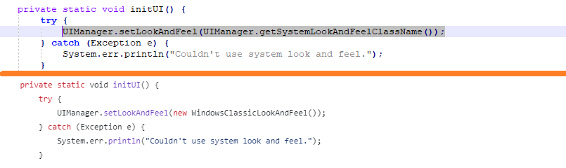
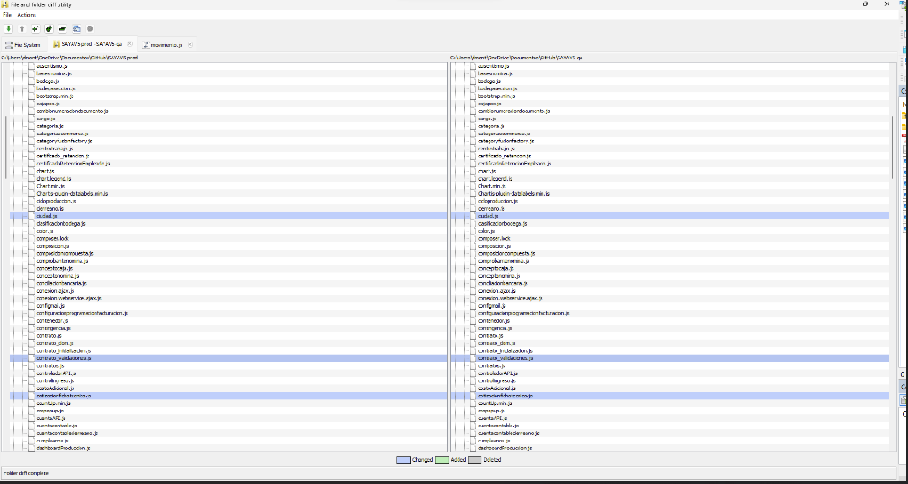
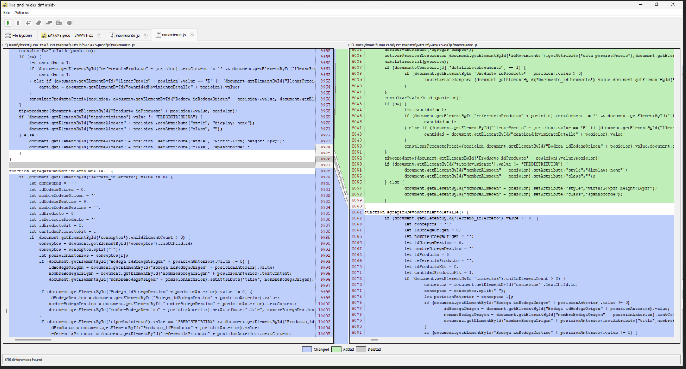
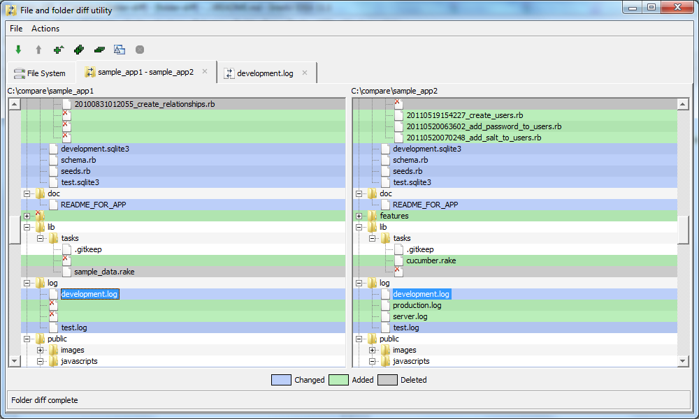
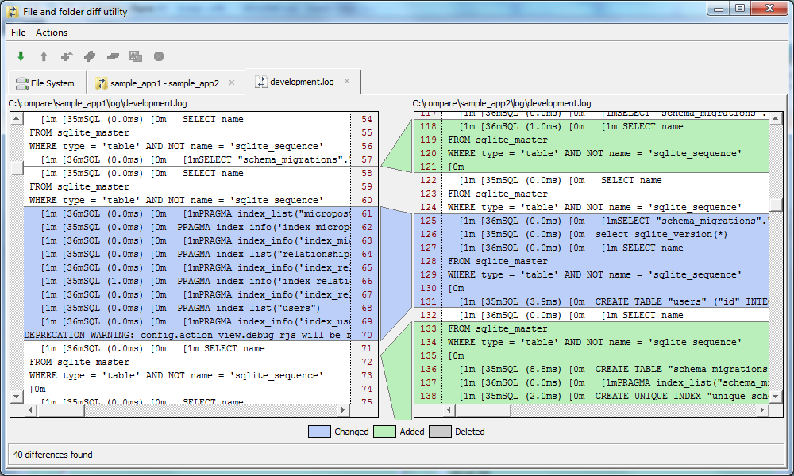
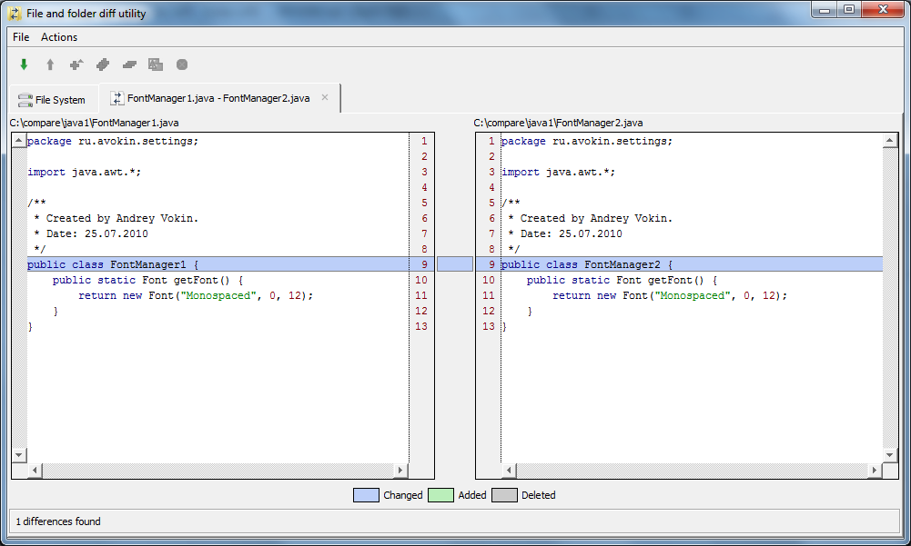

# Folder-Diff-2

## About
Project "folder-diff" version 2.0

It is an application that allows to browse differences of two directories or two files. "folder-diff" marks inserted, deleted and changed text.

The app has syntax highlighting for Java programming language. Also it's easy to add highlighting of any other language as a plugin.

## Note

This is a copy of the original project repository [@avokin/folder-diff](https://github.com/avokin/folder-diff) with some modification to work with a non obsolete version de Java and Maven. 

The original project is from 2012 with last commit in 2015, this new revision was release in 2023.

It was compiled using Apache Netbeans with Maven and Java 8.

Finally, a change to replace deprecated import com.sun.java.swing.plaf.windows.WindowsClassicLookAndFeel with UIManager.getSystemLookAndFeelClassName() class method call.

## Screenshots

Differences between two directories displayed as follows:

File or folder that exists in the left window but missed in the right has gray background (it was deleted).
File or folder that exists in the right window but missed in the left has green background (it was created).
File that has differences between the left and the right version has blue background (it was changed).

Differences in files represented in the same way. Added line has green background, deleted - gray and changed - blue:

Syntax highlighting implemented as follows:

